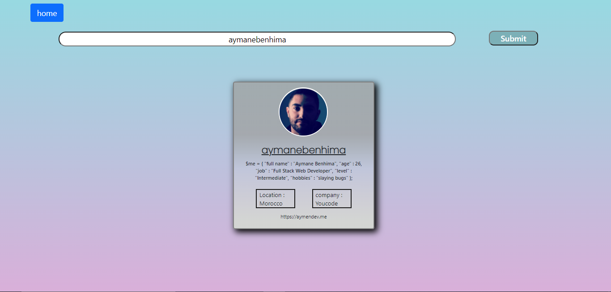

//GITHUB API PROJECT
A Simple website with a search fonctionality displaying infos about a specific GITHUB user .

//Description
My project has two pages : 
the first one displays random Github Users with specified informations for each .
the second one offers a search bar that can Search for any github user informations based on his LOGIN name .
 

//Dependencies
Visual Studio Code .
Windows 10 .
Microsoft Edge navigator .

//Version History
0.2
Various bug fixes and optimizations
See commit change or See release history
0.1
Initial Release
License
This project is licensed under the SHIRO License - see the LICENSE.md file for details

//Acknowledgments
BOOTSTRAP
JAVASCRIPT API
dbader
zenorocha
fvcproductions